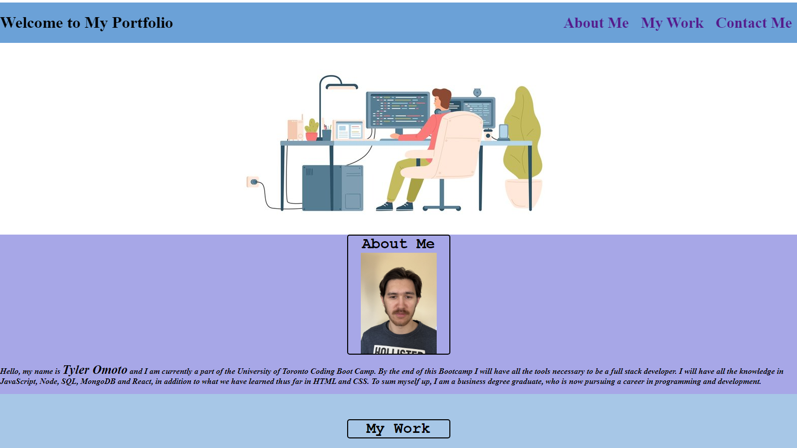

# 02 Advanced CSS: Portfolio

## Description
This weeks challenge was to create your own personal portfolio page without any given starter code. The goal of this assignment was to showcase some of the skills learned in HTML and CSS. A key point was to showcase one of your first applications and to have that link out to a deployed version. Based upon the acceptance criteria, I have created my own personal portfolio page, which contains much of what was learned throughout the week for advanced CSS and hope to continue to add to this as the course moves on.

## Screenshot

## Link
This [link](https://tyomoto.github.io/pizza-pepperoni/) will take you to the site on Github.